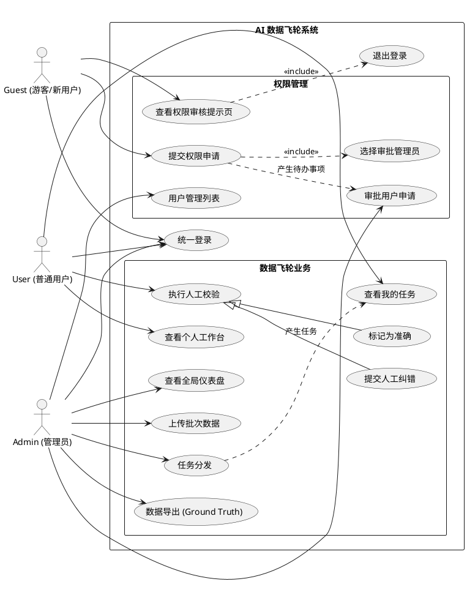
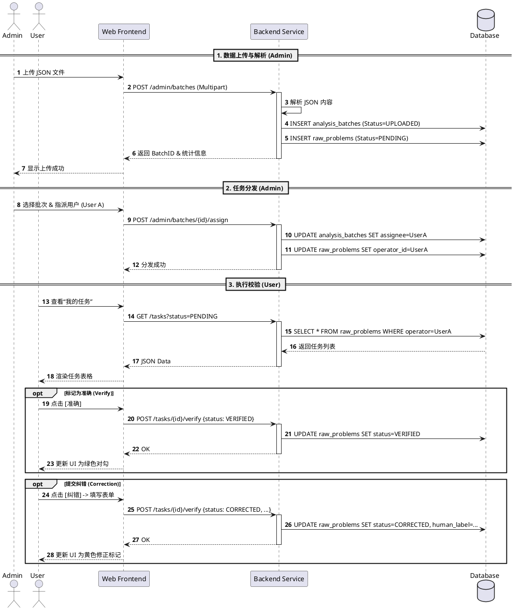

# 技术设计文档：AI 问题分类数据飞轮与人工校验系统

## 1. 摘要 (Summary)

本文档描述了一个“AI 问题分类数据飞轮系统”的设计方案。该系统旨在通过人工介入（Human-in-the-Loop）的方式，对 AI 模型的分类预测结果进行批量校验。系统提供管理员上传与任务分发功能，普通用户进行人工审核的界面，以及一个全局仪表盘用于监控模型准确率、人工校验进度及数据分布情况。该系统是数据闭环中的关键一环，旨在持续提升 AI 模型的预测能力。

## 2. 背景与目标 (Background & Goals)

### 背景
随着 AI 业务的扩展，模型对问题分类的预测需要持续监控与优化。目前缺乏一个统一的平台来管理模型预测结果的评估工作，人工校验过程分散且难以量化。

### 目标
- **构建校验流**：实现从“数据上传”到“任务分发”再到“人工校验”的完整闭环。
- **量化指标**：实时计算并展示 AI 的预测准确率、Top 5 错误类别等关键指标。
- **提升效率**：提供直观的用户界面，加速人工校验过程。
- **数据沉淀**：将人工校验后的高质量数据结构化存储，为模型迭代提供“真值”数据（Ground Truth）。

## 3. 非目标 (Non-Goals)
- **模型训练/推理**：本系统不负责运行 AI 模型进行实时预测，仅接收预测后的结果数据（JSON）。
- **通用标注平台**：本系统专用于“分类预测校验”场景，而非通用的图像或文本标注工具。

## 4. 需求分析 (Requirements)

### 4.1 功能需求 (Functional Requirements)

**角色：管理员 (Admin / System Administrator)**
*拥有系统最高权限，承担“超级管理员”职责。*
1.  **用户权限管理**：
    -   查看所有注册用户列表。
    -   **处理权限申请**：查看指定给自己的权限申请，或主动审批其他待审核用户。
    -   **审批新用户**：将注册后处于 `GUEST` 状态的用户，分配为 `USER`（普通操作员）或 `ADMIN`（管理员）。
    -   **权限回收**：禁用违规账号或降级权限。
2.  **批次管理**：上传包含 AI 预测结果的 JSON 文件，生成待分发批次。
3.  **任务分发**：将批次中的问题分配给指定的普通用户（或用户组）。
4.  **全局监控**：查看全局仪表盘，掌握整体进度和质量。
5.  **数据导出**：导出经过人工校验的高质量数据（CSV/JSON），用于模型迭代。

**角色：普通用户 (User)**
1.  **任务列表**：查看分配给自己的校验任务，包含批次信息。
2.  **人工校验**：针对具体问题，查看 AI 预测类别及**所属聚类总结**，交互式选择“准确”或“不准确”（可选修正类别及理由）。
3.  **进度查看**：查看当前分类任务下的剩余问题数。
4.  **个人工作台**：查看个人待办任务统计、最近任务快捷入口。

**角色：游客 (Guest/Pending)**
1.  **注册/登录**：通过统一入口注册账号或登录。
2.  **申请审批**：登录后在提示页可**选择指定的管理员**提交权限申请。
3.  **权限申请页**：提交申请后显示“已通知管理员 [Name] 审核中”，无法访问业务功能。

**仪表盘 (Dashboard)**
1.  **管理员视图 (Global)**：
    -   核心指标：AI 预测总数、批次总数、AI 准确率、人工矫正进度（已校验/总量）、待分发批次数量、**待审批用户数**。
    -   错误分析：展示 AI 预测错误的 Top 5 类别（即错误率最高的预测类别）。
    -   数据分布：展示所有类别的词云图。
2.  **普通用户视图 (Personal)**：
    -   我的待办任务数。
    -   最近处理的任务列表（带进度条）。
3.  **游客视图 (Guest)**：
    -   仅显示静态提示：“您的账号正在审核中，请联系管理员开通权限。”

### 4.2 非功能需求 (Non-functional Requirements)
- **响应速度**：校验操作（提交结果）延迟应 < 200ms。
- **并发性**：支持多用户同时进行校验工作。
- **数据一致性**：确保校验结果不会因并发操作而丢失或冲突。
- **易用性**：校验界面应尽可能减少点击次数，支持快捷键。

## 5. 系统架构 (Architecture Overview)

### 5.1 系统组件
系统采用经典的前后端分离架构：
- **Frontend (Web SPA)**: 基于 React/Vue 构建。**系统根据登录用户的角色（Admin/User）自动路由至相应的界面（管理后台或个人工作台），普通用户无法访问管理员功能。**
- **Backend Service**: 提供 RESTful API，处理业务逻辑、权限控制和数据聚合。
- **Database**: 关系型数据库 (PostgreSQL/MySQL) 存储用户、批次、问题数据及校验结果。
- **Object Storage (Optional)**: 存储原始上传的 JSON 文件备份（可视需求简化直接存 DB）。

### 5.2 架构图 (Architecture Diagram)

```ascii
+----------------+      +----------------+
|   Admin Web    |      |    User Web    |
+-------+--------+      +-------+--------+
        |                       |
        |   HTTPS / REST API    |
        v                       v
+----------------------------------------+
|           API Gateway / LB             |
+-------------------+--------------------+
                    |
          +---------v----------+
          |  Backend Service   |
          | (Core Logic, Auth) |
          +----+----------+----+
               |          |
      +--------v--+    +--v-----------+
      |  Database |    | File Storage |
      | (SQL DB)  |    | (JSON Logs)  |
      +-----------+    +--------------+
```

## 6. 详细设计 (Detailed Design)

### 6.2 模块交互 (Module Interaction)

#### 用例图 (Use Case Diagram)


#### 前端界面设计 (UI Wireframes)

**1. 统一登录页 (Unified Login)**
系统提供唯一的登录入口，包含用户名与密码输入框。
*   **交互流程**：
    1.  用户输入账号密码点击登录。
    2.  前端调用 `POST /api/auth/login`。
    3.  后端验证通过后返回 `token` 及 `role`。
    4.  前端根据 `role` 自动路由：
        *   `role='ADMIN'` -> 跳转至管理员仪表盘 (Admin Dashboard)。
        *   `role='USER'` -> 跳转至个人工作台 (User Workbench)。
        *   `role='GUEST'` -> 跳转至“权限审核中”提示页 (Guest Page)。

**2. 游客提示页 (Guest Landing Page)**
登录后若检测到角色为 `GUEST`，不加载标准 Layout，直接渲染全屏提示组件。
*   **视觉元素**：居中的大幅锁定图标 (Lock Icon)、醒目的状态标题（如“权限审核中”）。
*   **权限申请交互**：
    *   提供一个下拉框 **“选择审批管理员”**（列出所有 Admin）。
    *   提供 **“提交申请”** 按钮。
    *   提交后状态文案变更为：“已向管理员 [Name] 发送申请，请耐心等待。”
*   **其他交互**：提供 `Logout` 按钮，防止未授权用户误入内部路由。

**3. 我的矫正任务 (My Verification Tasks)**
展示一个分组表格，以**SPDT + IPMT + 聚类类别**为维度进行合并展示 (RowSpan)，直观呈现同一类问题的聚合情况。

```ascii
+---------------------------------------------------------------------------------------------------------------------------------------+
| 任务：issue_logs_2023.json                                                               [筛选: 全部/待办] [返回列表]                 |
+---------------------------------------------------------------------------------------------------------------------------------------+
| SPDT | IPMT | 聚类类别      | 聚类总结             | 问题数 | 用户矫正类别          | 矫正说明 | PROD_EN.. | RESOLUTION.. | ISSUE.. |
+---------------------------------------------------------------------------------------------------------------------------------------+
|      |      | 硬件问题      | 检测到物理设备...    |        | [ 准确 ] [ 纠错 ]     |          | DSP9800   | Replaced..   | Err..   |
| 分组A| XX   |  >            |                      |   2    | --------------------- | -------- | --------- | ------------ | ------- |
|      |      | 内存溢出      |                      |        | [AI准确]              |          | DSP9811   | Res alloc..  | Fail..  |
+---------------------------------------------------------------------------------------------------------------------------------------+
|      |      | 软件问题      | 空指针异常...        |        | [ 人工修正 ]          | 代码问题 | WebSvr    | Patch...     | Null..  |
| 分组B| YY   |  >            |                      |   1    | 软件 > 代码异常       |          |           |              |         |
|      |      | 代码异常      |                      |        | [ 修改 ]              |          |           |              |         |
+---------------------------------------------------------------------------------------------------------------------------------------+
```
*交互说明：*
*   **表格布局**：左侧元数据列（SPDT, IPMT, 类别, 总结）针对同一组问题进行合并（RowSpan），减少冗余信息。
*   **操作区**：
    *   **[准确]**：点击后状态变更为 `Verified`，显示绿色“AI准确”标记。
    *   **[纠错]**：点击弹出对话框，回显 AI 预测值，用户可修改为真实类别（大类/子类）并填写理由。提交后显示黄色“人工修正”标记及修正后的类别。

#### 校验任务时序图 (Sequence Diagram: Verification Task)



### 6.3 核心流程 (Core Processes)
1.  **统一登录与权限路由**：
    *   用户在登录页输入账号密码。
    *   后端验证通过，返回 Token 及 `role` (`ADMIN`, `USER`, `GUEST`)。
    *   前端根据 `role` 跳转：
        *   `ADMIN` -> 管理员仪表盘。
        *   `USER` -> 个人工作台。
        *   `GUEST` -> 权限审核申请页。
2.  **用户注册与授权**：
    *   新用户注册后，默认 `role=GUEST`，`target_approver_id=NULL`。
    *   **主动申请**：用户在 Guest 页面调用 `GET /admins` 获取管理员列表，选择一人调用 `POST /access-request`。后端更新该用户的 `target_approver_id`。
    *   **状态保持**：若 Guest 用户重新登录，前端检查 `target_approver_id`，若不为空则显示“已提交申请”状态。
    *   **审批**：目标管理员在后台看到“待办审批”通知，将该用户 `role` 修改为 `USER`（同时清空 `target_approver_id`）。
    *   用户重新登录获得权限。
3.  **上传流程**：管理员上传 JSON -> 后端解析 -> 存入 `analysis_batches` 表 -> 解析问题存入 `raw_problems` 表（状态：待分发）。
4.  **分发流程**：管理员选择批次 -> 选择用户 -> 后端更新 `analysis_batches` 表的 `assigned_user_id` -> 关联用户可查看批次下的 `raw_problems`。
5.  **校验流程**：用户获取任务 -> 提交校验结果 (IsCorrect) -> 后端更新 `raw_problems` 状态为 `CORRECTED` -> 触发统计更新（或异步计算）。

## 7. 数据库设计 (Database Design)

### 7.1 ER 图 (简述)
- `users` (1) <--- (N) `analysis_batches` (assigned_user_id)
- `users` (1) <--- (N) `raw_problems` (operator_id)
- `analysis_batches` (1) <--- (N) `ai_clusters_group`
- `ai_clusters_group` (1) <--- (N) `raw_problems`

### 7.2 表结构定义

**1. users (用户表)**
| Field | Type | Description |
|---|---|---|
| id | INT | PK |
| username | VARCHAR | 用户名 (UNIQUE) |
| role | ENUM | 'ADMIN', 'USER', 'GUEST' |
| status | ENUM | 'ACTIVE', 'DISABLED' |
| target_approver_id | INT | FK -> users.id (申请的审批人ID，NULL表示未申请或已通过) |
| password_hash | VARCHAR | 密码哈希 |
| created_at | DATETIME | 注册时间 |

*说明：新注册用户默认为 `role='GUEST'`, `status='ACTIVE'`。只有 `role` 被管理员修改为 `USER` 或 `ADMIN` 后才能进入业务系统。*

**2. analysis_batches (批次表)**
| Field | Type | Description |
|---|---|---|
| id | BIGINT | PK |
| batch_no | VARCHAR | 批次号 |
| source_channel | VARCHAR | 数据来源 |
| status | ENUM | 'UPLOADED', 'DISTRIBUTED', 'COMPLETED' |
| assigned_user_id | VARCHAR | FK -> users.username (被指派用户名) |
| total_count | INT | 总问题数 |
| created_at | DATETIME | 上传时间 |

**3. ai_clusters_group (AI 聚类表)**
| Field | Type | Description |
|---|---|---|
| id | BIGINT | PK (自增主键) |
| batch_id | BIGINT | FK -> analysis_batches.id (关联批次) |
| spdt | VARCHAR | SPDT字段 |
| ipmt | VARCHAR | IPMT字段 |
| category_large | VARCHAR | AI 聚类大类 |
| category_sub | VARCHAR | AI 聚类子类 |
| ai_cluster_summary | TEXT | AI 聚类总结 |
| problem_count | INT | 该组包含的问题数 |

**4. raw_problems (原始问题与矫正表)**
| Field | Type | Description |
|---|---|---|
| id | BIGINT | PK (自增主键) |
| cluster_id | BIGINT | FK -> ai_clusters_group.id (关联的聚类组ID) |

| prod_en_name | VARCHAR |  |
| resolution_detail | TEXT |  |
| issue_details | TEXT |  |
| issue_no | VARCHAR |  |
| issue_type | VARCHAR |  |

| correction_status | ENUM | 'PENDING', 'CORRECTED', 'VERIFIED', 'SKIPPED' |
| human_category_large | VARCHAR | 用户输入的矫正大类 |
| human_category_sub | VARCHAR | 用户输入的矫正子类 |
| human_reasoning | TEXT | 用户输入的矫正理由 |
| operator_id | VARCHAR | FK -> users.username (操作人工号) |
| updated_at | DATETIME | 更新时间 |

### 7.3 索引策略
- `analysis_batches(assigned_user_id, status)`: 加速用户查询待处理批次。
- `ai_clusters_group(batch_id)`: 加速批次下聚类组的加载。
- `raw_problems(cluster_id)`: 加速聚类下问题的加载。
- `raw_problems(operator_id, correction_status)`: 统计用户工作量。

## 8. 数据模型 (Data Models)

### 输入文件格式 (JSON)
```json
[
  {
    "RESOLUTION_SUMMARY": "Replaced the faulty component.",
    "ROOT_CAUSE": "Defect-Huawei Product-Software",
    "PROBLEM_DETAIL": "System crashed after update.",
    "RESOLUTION_DETAIL": "Patched the kernel module.",
    "ISSUE_DETAILS": "Error code 500 received.",
    "TYPE": "Bug"
  },
  ...
]
```

## 9. API 设计 (API Spec)

### 9.1 身份认证 (Auth)
- **POST** `/api/auth/login`
- **Request**: `{ "username": "...", "password": "..." }`
- **Response**:
```json
{
  "token": "eyJhbGci...",
  "user": {
    "id": 1,
    "username": "admin",
    "role": "ADMIN" // 前端据此路由至 /admin/dashboard
  }
}
```

### 9.2 用户权限管理 (Admin Only)
*管理员通过此接口行使“超级管理员”职责，对新注册的 Guest 用户进行授权。*
- **GET** `/api/common/admins` (Public/Guest)
    - **Description**: 获取管理员列表（ID, Username），供 Guest 选择审批人。
- **POST** `/api/user/access-request` (Guest)
    - **Request**: `{ "target_admin_id": 1 }`
    - **Description**: 提交权限申请。
- **GET** `/api/admin/users`
    - **Query**: `?status=ACTIVE&role=GUEST` (筛选待审核用户)
    - **Response**: 用户列表（包含 `target_approver_id` 以便前端高亮显示指派给当前管理员的申请）。
- **PATCH** `/api/admin/users/{userId}/role`
    - **Request**: `{ "role": "USER" }` (授权为普通用户)
    - **Description**: 将用户从游客升级为正式用户，使其能进入工作台。

### 9.3 批次上传 (Admin)
- **POST** `/api/admin/batches`
- **Request**: Multipart file (JSON)
- **Response**:
```json
{
  "batch_id": 101,
  "total_imported": 500,
  "status": "success"
}
```

### 9.2 任务分发 (Admin)
- **POST** `/api/admin/batches/{batchId}/assign`
- **Request**:
```json
{
  "user_ids": [1, 2, 3],
  "strategy": "AVERAGE" // 平均分配
}
```

### 9.3 获取校验任务 (User)
- **GET** `/api/tasks?status=PENDING`
- **Response**:
```json
{
  "code": 200,
  "data": [
    {
      "groupId": 101,
      "categoryLarge": "网络问题",
      "categorySub": "组网协议异常",
      "aiSummary": "用户反馈连接中断...",
      "spdt": "分组A",
      "ipmt": "XX",
      "issueCount": 2,
      "items": [
        {
          "issueId": 1001,
          "prodEnName": "DSP9800",
          "issueDetails": "Error 0x88F...",
          "correctionStatus": "VERIFIED",
          "humanCategoryLarge": null,
          "humanCategorySub": null,
          "humanReasoning": null
        },
        {
          "issueId": 1002,
          "prodEnName": "DSP9811",
          "issueDetails": "Resource alloc failed...",
          "correctionStatus": "CORRECTED",
          "humanCategoryLarge": "硬件问题",
          "humanCategorySub": "内存溢出",
          "humanReasoning": "日志显示物理损坏"
        }
      ]
    }
  ]
}
```

### 9.4 提交校验 (User)
- **POST** `/api/tasks/{taskId}/verify`
- **Request**:
```json
{
  "correction_status": "CORRECTED", // 或 VERIFIED
  "human_category_large": "软件问题", 
  "human_category_sub": "代码异常",
  "human_reasoning": "The issue mentions database connection..." // 可选
}
```

### 9.6 仪表盘统计 (Dashboard)
#### 9.6.1 全局统计 (Admin)
- **GET** `/api/admin/dashboard/stats`
- **Response**:
```json
{
  "total_predicted": 10000,
  "accuracy": 0.85, 
  "pending_batches": 2,
  "pending_user_requests": 3, // 新增：待我审批的用户数
  "correction_progress": 0.60,
  "top_errors": [
    {"category": "Billing", "value": 150},
    {"category": "Login", "value": 120}
  ],
  "word_cloud": [
    {"name": "Billing", "value": 500},
    {"name": "Account", "value": 300}
  ]
}
```

#### 9.6.2 个人统计 (User)
- **GET** `/api/user/dashboard/stats`
- **Response**:
```json
{
  "my_pending_tasks_count": 15,
  "recent_tasks": [
    { "batch_id": 101, "file_name": "log_01.json", "progress": 0.8 }
  ]
}
```

### 9.7 数据导出 (Admin)
- **GET** `/api/admin/batches/{batchId}/export`
- **Response**: CSV/JSON File Download

## 10. 异常处理 (Error Handling)
- **上传错误**：校验 JSON 格式，若格式非法返回 `400 Bad Request` 并提示具体行号。
- **并发冲突**：若通过 Optimistic Lock (乐观锁) 发现任务已被他人校验（极少见，因为已预分配），提示用户“该任务已完成”并自动跳转下一题。
- **系统错误**：统一返回 `500` 并在后端记录 Stack Trace。

## 11. 日志与监控 (Logging & Observability)
- **操作日志**：记录 Admin 的分发操作、User 的登录与校验时间。
- **性能监控**：监控 `/verify` 接口的 P99 延迟，确保校验体验流畅。
- **业务监控**：定期统计“未完成任务”积压情况，通过邮件或系统通知提醒管理员。

## 12. 性能与扩展性 (Performance & Scalability)
- **数据库**：随着问题数量增加 (百万级)，`problems` 表需按 `created_at` 或 `batch_id` 进行分区 (Partitioning)。
- **缓存**：仪表盘的聚合数据（如 Accuracy, Word Cloud）计算成本高，应在 Redis 中缓存，每 5-10 分钟刷新一次，或在校验提交时异步增量更新。

## 13. 安全性与权限 (Security & Access Control)
- **RBAC**：严格区分 Admin 和 User 权限。Admin 接口需校验 `role=ADMIN`。
- **数据脱敏**：若问题内容包含敏感 PII 信息，需在入库前或展示前进行掩码处理。
- **CSRF/XSS**：Web 端需开启标准防护。

## 14. 部署方案 (Deployment Plan)
- **容器化**：Backend 和 Frontend 构建为 Docker 镜像。
- **编排**：使用 Kubernetes 或 Docker Compose 部署。
- **CI/CD**：代码提交 -> 自动测试 -> 构建镜像 -> 自动部署到 Staging 环境。

## 15. 测试方案 (Test Strategy)
- **单元测试**：覆盖准确率计算逻辑、文件解析逻辑。
- **集成测试**：模拟完整的“上传-分发-校验-统计”流程，确保数据库状态流转正确。
- **UI 测试**：使用 Cypress/Selenium 测试校验按钮的交互响应。

## 17. 数据飞轮机制 (Data Flywheel Implementation)

本系统不仅仅是“人工校验工具”，更是“数据飞轮”的核心引擎。通过持续的“预测-校验-训练”闭环，实现模型能力的自我进化。

### 17.1 飞轮闭环流程
```ascii
      +-----------------+       (1) Predict        +----------------+
      |   Raw Issues    | -----------------------> |   AI Model     |
      +--------+--------+                          +--------+-------+
               ^                                            |
               |                                            | (2) Output
      (5) Re-train / Fine-tune                              v
               |                                   +--------+-------+
      +--------+--------+                          |   Check System |
      |  Model Training | <----------------------- | (Human Verify) |
      +-----------------+       (4) Export GT      +----------------+
                               (Ground Truth)
```

### 17.2 关键步骤设计

**阶段一：数据接入与预测 (Inference)**
- 管理员上传待分类问题（Raw Data）。
- 调用当前版本 AI 模型进行批量预测，生成初步分类标签及置信度。
- **策略**：对于置信度 < 0.8 的低信度数据，标记为“优先校验”。

**阶段二：人工清洗与沉淀 (Cleaning)**
- 用户在校验界面对 AI 预测结果进行审核。
- **正向反馈**：点击 [AI准确]，确认该样本为正确样本。
- **负向反馈**：点击 [我要纠错]，提供修正后的真实标签 (Label) 及修正理由 (Reasoning)。
- **数据分级**：系统自动将校验后的数据标记为 `Golden Dataset`（高价值真值）。

**阶段三：数据导出与迭代 (Export & Iterate)**
- 管理员通过 `/api/admin/batches/{batchId}/export` 接口导出已完成校验的批次数据。
- 数据格式清洗为训练格式（如 `{"text": "...", "label": "..."}`）。
- **自动化触发 (Future)**：当积累的 `Golden Dataset` 达到一定阈值（如 1000 条），自动触发触发 CI/CD流水线中的模型重训练 (Retrain) 或微调 (Fine-tune) 任务。

**阶段四：模型部署与评估 (Deploy)**
- 新模型上线替换旧模型。
- **效果验证**：使用新模型对历史困难样本进行回测，验证准确率是否提升（如 Top 5 错误率是否下降）。
- 飞轮转动：新模型用于下一批数据的预测，预期人工修正率应逐渐降低。

