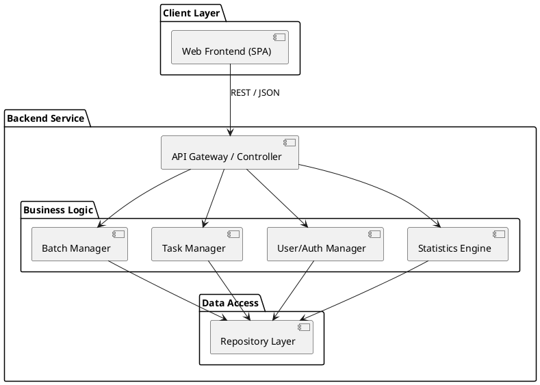
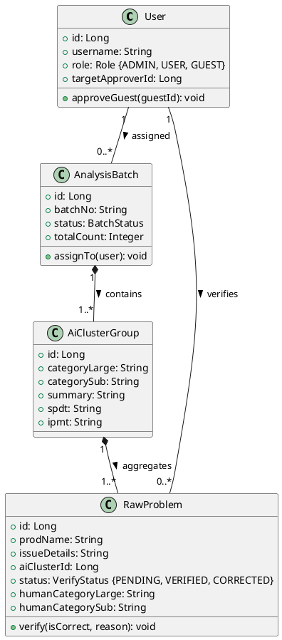
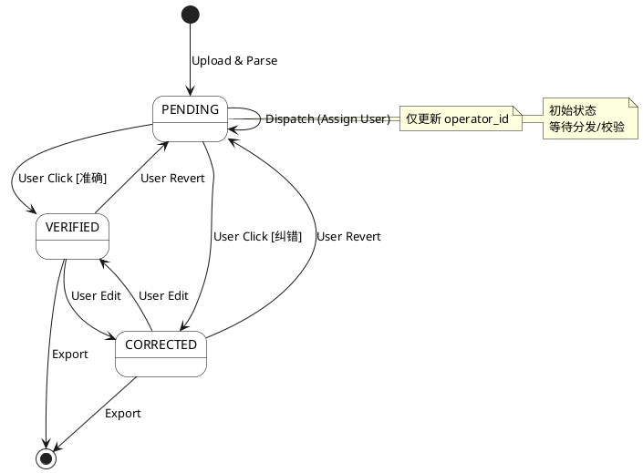
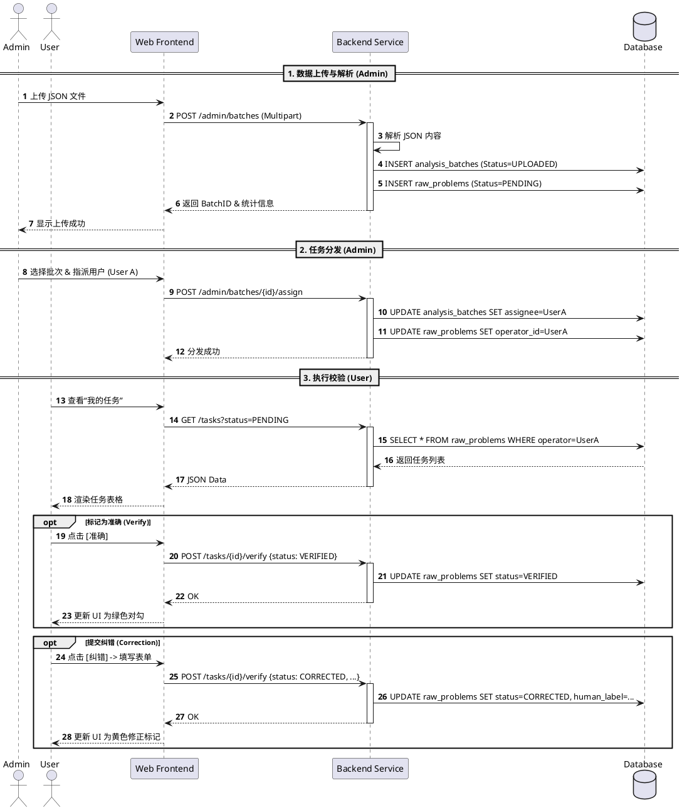
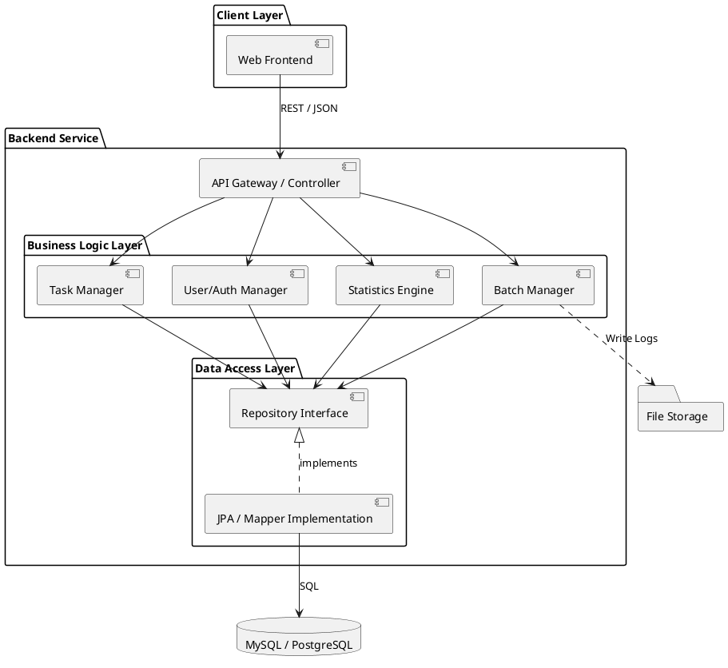
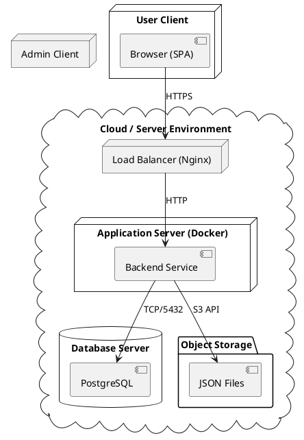
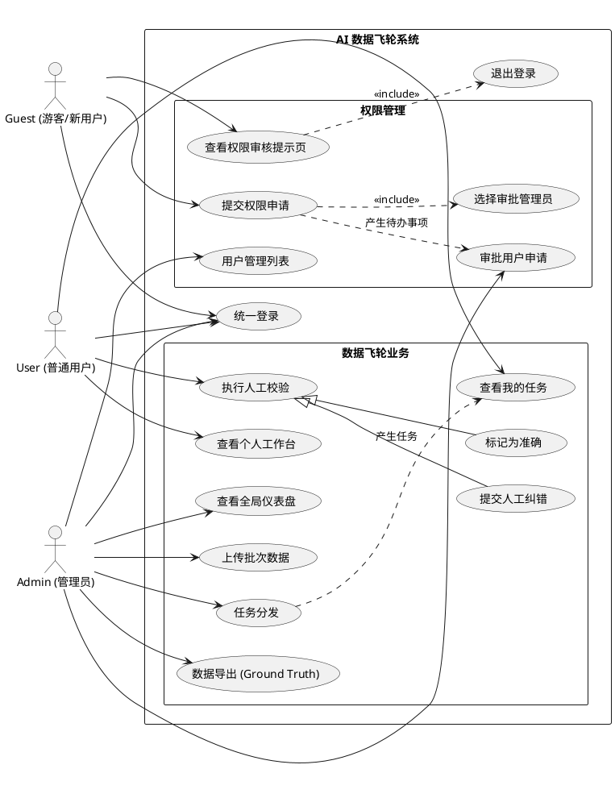

# 技术设计文档：AI 问题分类数据飞轮与人工校验系统

## 1. 摘要 (Summary)

本文档描述了一个“AI 问题分类数据飞轮系统”的设计方案。该系统旨在通过人工介入（Human-in-the-Loop）的方式，对 AI 模型的分类预测结果进行批量校验。系统提供管理员上传与任务分发功能，普通用户进行人工审核的界面，以及一个全局仪表盘用于监控模型准确率、人工校验进度及数据分布情况。该系统是数据闭环中的关键一环，旨在持续提升 AI 模型的预测能力。

## 2. 背景与目标 (Background & Goals)

### 背景
随着 AI 业务的扩展，模型对问题分类的预测需要持续监控与优化。目前缺乏一个统一的平台来管理模型预测结果的评估工作，人工校验过程分散且难以量化。

### 目标
- **构建校验流**：实现从“数据上传”到“任务分发”再到“人工校验”的完整闭环。
- **量化指标**：实时计算并展示 AI 的预测准确率、Top 5 错误类别等关键指标。
- **提升效率**：提供直观的用户界面，加速人工校验过程。
- **数据沉淀**：将人工校验后的高质量数据结构化存储，为模型迭代提供“真值”数据（Ground Truth）。

## 3. 非目标 (Non-Goals)
- **模型训练/推理**：本系统不负责运行 AI 模型进行实时预测，仅接收预测后的结果数据（JSON）。
- **通用标注平台**：本系统专用于“分类预测校验”场景，而非通用的图像或文本标注工具。

## 4. 需求分析 (Requirements)

### 4.1 功能需求 (Functional Requirements)

**角色：管理员 (Admin / System Administrator)**
*拥有系统最高权限，承担“超级管理员”职责。*
1.  **用户权限管理**：
    -   查看所有注册用户列表。
    -   **处理权限申请**：查看指定给自己的权限申请，或主动审批其他待审核用户。
    -   **审批新用户**：将注册后处于 `GUEST` 状态的用户，分配为 `USER`（普通操作员）或 `ADMIN`（管理员）。
    -   **权限回收**：禁用违规账号或降级权限。
2.  **批次管理**：上传包含 AI 预测结果的 JSON 文件，生成待分发批次。
3.  **任务分发**：将批次中的问题分配给指定的普通用户（或用户组）。
4.  **全局监控**：查看全局仪表盘，掌握整体进度和质量。
5.  **数据导出**：导出经过人工校验的高质量数据（CSV/JSON），用于模型迭代。

**角色：普通用户 (User)**
1.  **任务列表**：查看分配给自己的校验任务，包含批次信息。
2.  **人工校验**：针对具体问题，查看 AI 预测类别及**所属聚类总结**，交互式选择“准确”或“不准确”（可选修正类别及理由）。
3.  **进度查看**：查看当前分类任务下的剩余问题数。
4.  **个人工作台**：查看个人待办任务统计、最近任务快捷入口。

**角色：游客 (Guest/Pending)**
1.  **注册/登录**：通过统一入口注册账号或登录。
2.  **申请审批**：登录后在提示页可**选择指定的管理员**提交权限申请。
3.  **权限申请页**：提交申请后显示“已通知管理员 [Name] 审核中”，无法访问业务功能。

**仪表盘 (Dashboard)**
1.  **管理员视图 (Global)**：
    -   核心指标：AI 预测总数、批次总数、AI 准确率、人工矫正进度（已校验/总量）、待分发批次数量、**待审批用户数**。
    -   错误分析：展示 AI 预测错误的 Top 5 类别（即错误率最高的预测类别）。
    -   数据分布：展示所有类别的词云图。
2.  **普通用户视图 (Personal)**：
    -   我的待办任务数。
    -   最近处理的任务列表（带进度条）。
3.  **游客视图 (Guest)**：
    -   仅显示静态提示：“您的账号正在审核中，请联系管理员开通权限。”

### 4.2 非功能需求 (Non-functional Requirements)
- **响应速度**：校验操作（提交结果）延迟应 < 200ms。
- **并发性**：支持多用户同时进行校验工作。
- **数据一致性**：确保校验结果不会因并发操作而丢失或冲突。
- **易用性**：校验界面应尽可能减少点击次数，支持快捷键。

## 5. 系统架构 (Architecture - 4+1 Views)

### 5.1 逻辑视图 (Logical View)
*关注系统的功能逻辑与领域模型，描述系统“是什么”。*

#### 5.1.1 架构概览
系统采用经典的前后端分离架构，后端基于领域驱动设计 (DDD) 思想分层。



#### 5.1.2 核心领域模型 (Class Diagram)
*展示 User, Batch, Problem 等核心实体及其静态关系。*



### 5.2 过程视图 (Process View)
*关注系统的运行时行为、并发与流程交互，描述系统“怎么做”。*

#### 5.2.1 核心状态流转 (State Machine)
*描述“问题 (Problem)”对象在生命周期中的状态变化。*



#### 5.2.2 核心业务时序 (Sequence Diagram)
*描述“上传 -> 分发 -> 校验”的全链路交互。*



### 5.3 开发视图 (Development View)
*关注软件模块的组织、层级划分及依赖关系，服务于开发人员。*

#### 5.3.1 组件依赖 (Component Diagram)


### 5.4 物理视图 (Physical View)
*关注系统的部署拓扑、物理节点及网络通信。*

#### 5.3.1 部署架构 (Deployment Diagram)


### 5.5 场景视图 (Scenarios / Use Case View)
*关注最终用户与系统的交互，是架构设计的驱动力。*

#### 5.4.1 用例图 (Use Case Diagram)


## 6. 技术栈选型 (Technology Stack Selection)

### 6.1 前端技术 (Frontend)
- **核心框架**: Vue 3
- **构建工具**: Vite
- **UI 组件库**: Element Plus
- **数据可视化**: ECharts 5
- **状态管理**: Pinia
- **CSS 预处理器**: Sass/Scss

### 6.2 后端技术 (Backend)
- **开发语言**: Java 8 (JDK 1.8)
- **Web 框架**: Spring Boot 2.7.x
- **持久层框架**: MyBatis Plus
- **数据库**: MySQL 5.7
- **构建工具**: Maven 3.9

## 7. 数据库设计 (Database Design)

### 7.1 ER 图 (简述)
- `users` (1) <--- (N) `analysis_batches` (assigned_user_id)
- `users` (1) <--- (N) `raw_problems` (operator_id)
- `analysis_batches` (1) <--- (N) `ai_clusters_group`
- `ai_clusters_group` (1) <--- (N) `raw_problems`

### 7.2 表结构定义

**1. users (用户表)**
| Field | Type | Description |
|---|---|---|
| id | INT | PK |
| username | VARCHAR | 用户名 (UNIQUE) |
| role | ENUM | 'ADMIN', 'USER', 'GUEST' |
| status | ENUM | 'ACTIVE', 'DISABLED' |
| target_approver_id | INT | FK -> users.id (申请的审批人ID，NULL表示未申请或已通过) |
| password_hash | VARCHAR | 密码哈希 |
| created_at | DATETIME | 注册时间 |

*说明：新注册用户默认为 `role='GUEST'`, `status='ACTIVE'`。只有 `role` 被管理员修改为 `USER` 或 `ADMIN` 后才能进入业务系统。*

**2. analysis_batches (批次表)**
| Field | Type | Description |
|---|---|---|
| id | BIGINT | PK |
| batch_no | VARCHAR | 批次号 |
| source_channel | VARCHAR | 数据来源 |
| status | ENUM | 'UPLOADED', 'DISTRIBUTED', 'COMPLETED' |
| assigned_user_id | VARCHAR | FK -> users.username (被指派用户名) |
| total_count | INT | 总问题数 |
| created_at | DATETIME | 上传时间 |

**3. ai_clusters_group (AI 聚类表)**
| Field | Type | Description |
|---|---|---|
| id | BIGINT | PK (自增主键) |
| batch_id | BIGINT | FK -> analysis_batches.id (关联批次) |
| spdt | VARCHAR | SPDT字段 |
| ipmt | VARCHAR | IPMT字段 |
| category_large | VARCHAR | AI 聚类大类 |
| category_sub | VARCHAR | AI 聚类子类 |
| ai_cluster_summary | TEXT | AI 聚类总结 |
| problem_count | INT | 该组包含的问题数 |

**4. raw_problems (原始问题与矫正表)**
| Field | Type | Description |
|---|---|---|
| id | BIGINT | PK (自增主键) |
| cluster_id | BIGINT | FK -> ai_clusters_group.id (关联的聚类组ID) |

| prod_en_name | VARCHAR |  |
| resolution_detail | TEXT |  |
| issue_details | TEXT |  |
| issue_no | VARCHAR |  |
| issue_type | VARCHAR |  |

| correction_status | ENUM | 'PENDING', 'CORRECTED', 'VERIFIED', 'SKIPPED' |
| human_category_large | VARCHAR | 用户输入的矫正大类 |
| human_category_sub | VARCHAR | 用户输入的矫正子类 |
| human_reasoning | TEXT | 用户输入的矫正理由 |
| operator_id | VARCHAR | FK -> users.username (操作人工号) |
| updated_at | DATETIME | 更新时间 |

### 7.3 索引策略
- `analysis_batches(assigned_user_id, status)`: 加速用户查询待处理批次。
- `ai_clusters_group(batch_id)`: 加速批次下聚类组的加载。
- `raw_problems(cluster_id)`: 加速聚类下问题的加载。
- `raw_problems(operator_id, correction_status)`: 统计用户工作量。

## 8. 数据模型 (Data Models)

### 输入文件格式 (JSON)
```json
[
  {
    "RESOLUTION_SUMMARY": "Replaced the faulty component.",
    "ROOT_CAUSE": "Defect-Huawei Product-Software",
    "PROBLEM_DETAIL": "System crashed after update.",
    "RESOLUTION_DETAIL": "Patched the kernel module.",
    "ISSUE_DETAILS": "Error code 500 received.",
    "TYPE": "Bug"
  },
  ...
]
```

## 9. API 设计 (API Spec)

### 9.1 身份认证 (Authentication)
*Token Based Authentication (JWT)*

#### 9.1.1 用户登录
- **POST** `/api/auth/login`
- **Summary**: 用户名密码登录，返回 Token 及角色。
- **Request Body**:
  ```json
  {
    "username": "admin",
    "password": "password123"
  }
  ```
- **Response (200 OK)**:
  ```json
  {
    "token": "eyJhbGciOiJIUzI1Ni...",
    "user": {
      "id": 1,
      "username": "admin",
      "role": "ADMIN",
      "status": "ACTIVE"
    }
  }
  ```

#### 9.1.2 用户注册
- **POST** `/api/auth/register`
- **Summary**: 新用户注册，默认角色为 GUEST。
- **Request Body**:
  ```json
  {
    "username": "new_user",
    "password": "password123"
  }
  ```
- **Response (201 Created)**:
  ```json
  {
    "id": 10,
    "username": "new_user",
    "role": "GUEST",
    "message": "Registered successfully. Please wait for approval."
  }
  ```

### 9.2 用户权限管理 (User Management)
*Requires Role: ADMIN*

#### 9.2.1 获取管理员列表 (Public/Guest)
- **GET** `/api/common/admins`
- **Summary**: 获取所有管理员的基本信息，供 Guest 选择审批人。
- **Response**:
  ```json
  [
    { "id": 1, "username": "admin_zhang" },
    { "id": 2, "username": "manager_li" }
  ]
  ```

#### 9.2.2 提交权限申请 (Guest)
- **POST** `/api/user/access-request`
- **Summary**: Guest 用户提交权限申请，指定审批人。
- **Request Body**:
  ```json
  { "target_admin_id": 1 }
  ```
- **Response**: `{ "status": "success" }`

#### 9.2.3 获取用户列表 (Admin)
- **GET** `/api/admin/users`
- **Summary**: 查询用户列表，支持筛选。
- **Query Params**:
  - `role`: (Optional) 筛选角色 (GUEST/USER/ADMIN)
  - `status`: (Optional) ACTIVE/DISABLED
- **Response**:
  ```json
  [
    {
      "id": 10,
      "username": "guest_01",
      "role": "GUEST",
      "created_at": "2023-10-01T10:00:00Z",
      "target_approver_id": 1 // 用于高亮“待我审批”
    }
  ]
  ```

#### 9.2.4 修改用户角色/状态 (Admin)
- **PATCH** `/api/admin/users/{userId}`
- **Summary**: 审批用户（升级角色）或禁用用户。
- **Request Body**:
  ```json
  {
    "role": "USER", // Optional: GUEST -> USER
    "status": "ACTIVE" // Optional
  }
  ```

### 9.3 批次管理 (Batch Management)
*Requires Role: ADMIN*

#### 9.3.1 上传预测结果
- **POST** `/api/admin/batches`
- **Summary**: 上传 JSON 文件，创建新批次。
- **Content-Type**: `multipart/form-data`
- **Form Data**: `file`: (Binary JSON File)
- **Response**:
  ```json
  {
    "batch_id": 101,
    "file_name": "log_2023.json",
    "total_count": 500,
    "status": "UPLOADED"
  }
  ```

#### 9.3.2 获取批次列表
- **GET** `/api/admin/batches`
- **Summary**: 查看所有批次状态。
- **Response**:
  ```json
  [
    {
      "id": 101,
      "batch_no": "B-20231001",
      "status": "UPLOADED",
      "assignee": null,
      "created_at": "..."
    }
  ]
  ```

#### 9.3.3 任务分发
- **POST** `/api/admin/batches/{batchId}/assign`
- **Summary**: 将批次指派给指定用户。
- **Request Body**:
  ```json
  {
    "user_id": 5, // 指派给 User ID 5
    "strategy": "ALL" // 目前仅支持整批分配
  }
  ```

#### 9.3.4 导出真值数据
- **GET** `/api/admin/batches/{batchId}/export`
- **Summary**: 导出已校验的数据 (CSV/JSON)。
- **Response**: File Download Stream.

### 9.4 校验任务 (Verification Task)
*Requires Role: USER*

#### 9.4.1 获取我的任务列表
- **GET** `/api/tasks`
- **Summary**: 获取分配给当前用户的任务（按批次聚合）。
- **Query Params**: `status=PENDING` (Optional)
- **Response**:
  ```json
  {
    "summary": { "pending_count": 12, "completed_count": 5 },
    "tasks": [
      {
        "batch_id": 101,
        "file_name": "log_2023.json",
        "progress": 0.45,
        "groups": [
          {
            "group_id": 1001,
            "category_large": "Network",
            "category_sub": "Timeout",
            "summary": "Connection timeout...",
            "items": [
              {
                "issue_id": 5001,
                "prod_name": "Router-X",
                "detail": "Error 503",
                "status": "PENDING"
              }
            ]
          }
        ]
      }
    ]
  }
  ```

#### 9.4.2 提交单题校验
- **POST** `/api/tasks/{issueId}/verify`
- **Summary**: 提交单个问题的校验结果（准确/纠错）。
- **Request Body**:
  ```json
  {
    "status": "CORRECTED", // VERIFIED or CORRECTED
    "human_category_large": "Hardware", // Required if CORRECTED
    "human_category_sub": "Disk_Fail",  // Required if CORRECTED
    "reason": "Log shows disk full error" // Optional
  }
  ```

### 9.5 仪表盘统计 (Dashboard)

#### 9.5.1 全局统计 (Admin)
- **GET** `/api/admin/dashboard/stats`
- **Summary**: 全局核心指标。
- **Response**:
  ```json
  {
    "total_predictions": 10000,
    "accuracy": 0.85,
    "pending_batches": 2,
    "pending_user_requests": 3,
    "top_errors": [{"category": "Billing", "value": 150}],
    "word_cloud": [{"name": "Error", "value": 500}]
  }
  ```

#### 9.5.2 个人统计 (User)
- **GET** `/api/user/dashboard/stats`
- **Summary**: 个人工作量统计。
- **Response**:
  ```json
  {
    "my_pending_count": 15,
    "my_verified_count": 120,
    "recent_activity": [...]
  }
  ```

## 10. 异常处理 (Error Handling)
- **上传错误**：校验 JSON 格式，若格式非法返回 `400 Bad Request` 并提示具体行号。
- **并发冲突**：若通过 Optimistic Lock (乐观锁) 发现任务已被他人校验（极少见，因为已预分配），提示用户“该任务已完成”并自动跳转下一题。
- **系统错误**：统一返回 `500` 并在后端记录 Stack Trace。

## 11. 日志与监控 (Logging & Observability)
- **操作日志**：记录 Admin 的分发操作、User 的登录与校验时间。
- **性能监控**：监控 `/verify` 接口的 P99 延迟，确保校验体验流畅。
- **业务监控**：定期统计“未完成任务”积压情况，通过邮件或系统通知提醒管理员。

## 12. 性能与扩展性 (Performance & Scalability)
- **数据库**：随着问题数量增加 (百万级)，`problems` 表需按 `created_at` 或 `batch_id` 进行分区 (Partitioning)。
- **缓存**：仪表盘的聚合数据（如 Accuracy, Word Cloud）计算成本高，应在 Redis 中缓存，每 5-10 分钟刷新一次，或在校验提交时异步增量更新。

## 13. 安全性与权限 (Security & Access Control)
- **RBAC**：严格区分 Admin 和 User 权限。Admin 接口需校验 `role=ADMIN`。
- **数据脱敏**：若问题内容包含敏感 PII 信息，需在入库前或展示前进行掩码处理。
- **CSRF/XSS**：Web 端需开启标准防护。

## 14. 部署方案 (Deployment Plan)
- **容器化**：Backend 和 Frontend 构建为 Docker 镜像。
- **编排**：使用 Kubernetes 或 Docker Compose 部署。
- **CI/CD**：代码提交 -> 自动测试 -> 构建镜像 -> 自动部署到 Staging 环境。

## 15. 测试方案 (Test Strategy)
- **单元测试**：覆盖准确率计算逻辑、文件解析逻辑。
- **集成测试**：模拟完整的“上传-分发-校验-统计”流程，确保数据库状态流转正确。
- **UI 测试**：使用 Cypress/Selenium 测试校验按钮的交互响应。

## 17. 数据飞轮机制 (Data Flywheel Implementation)

本系统不仅仅是“人工校验工具”，更是“数据飞轮”的核心引擎。通过持续的“预测-校验-训练”闭环，实现模型能力的自我进化。

### 17.1 飞轮闭环流程
```ascii
      +-----------------+       (1) Predict        +----------------+
      |   Raw Issues    | -----------------------> |   AI Model     |
      +--------+--------+                          +--------+-------+
               ^                                            |
               |                                            | (2) Output
      (5) Re-train / Fine-tune                              v
               |                                   +--------+-------+
      +--------+--------+                          |   Check System |
      |  Model Training | <----------------------- | (Human Verify) |
      +-----------------+       (4) Export GT      +----------------+
                               (Ground Truth)
```

### 17.2 关键步骤设计

**阶段一：数据接入与预测 (Inference)**
- 管理员上传待分类问题（Raw Data）。
- 调用当前版本 AI 模型进行批量预测，生成初步分类标签及置信度。
- **策略**：对于置信度 < 0.8 的低信度数据，标记为“优先校验”。

**阶段二：人工清洗与沉淀 (Cleaning)**
- 用户在校验界面对 AI 预测结果进行审核。
- **正向反馈**：点击 [AI准确]，确认该样本为正确样本。
- **负向反馈**：点击 [我要纠错]，提供修正后的真实标签 (Label) 及修正理由 (Reasoning)。
- **数据分级**：系统自动将校验后的数据标记为 `Golden Dataset`（高价值真值）。

**阶段三：数据导出与迭代 (Export & Iterate)**
- 管理员通过 `/api/admin/batches/{batchId}/export` 接口导出已完成校验的批次数据。
- 数据格式清洗为训练格式（如 `{"text": "...", "label": "..."}`）。
- **自动化触发 (Future)**：当积累的 `Golden Dataset` 达到一定阈值（如 1000 条），自动触发触发 CI/CD流水线中的模型重训练 (Retrain) 或微调 (Fine-tune) 任务。

**阶段四：模型部署与评估 (Deploy)**
- 新模型上线替换旧模型。
- **效果验证**：使用新模型对历史困难样本进行回测，验证准确率是否提升（如 Top 5 错误率是否下降）。
- 飞轮转动：新模型用于下一批数据的预测，预期人工修正率应逐渐降低。

